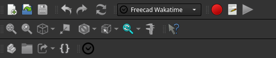
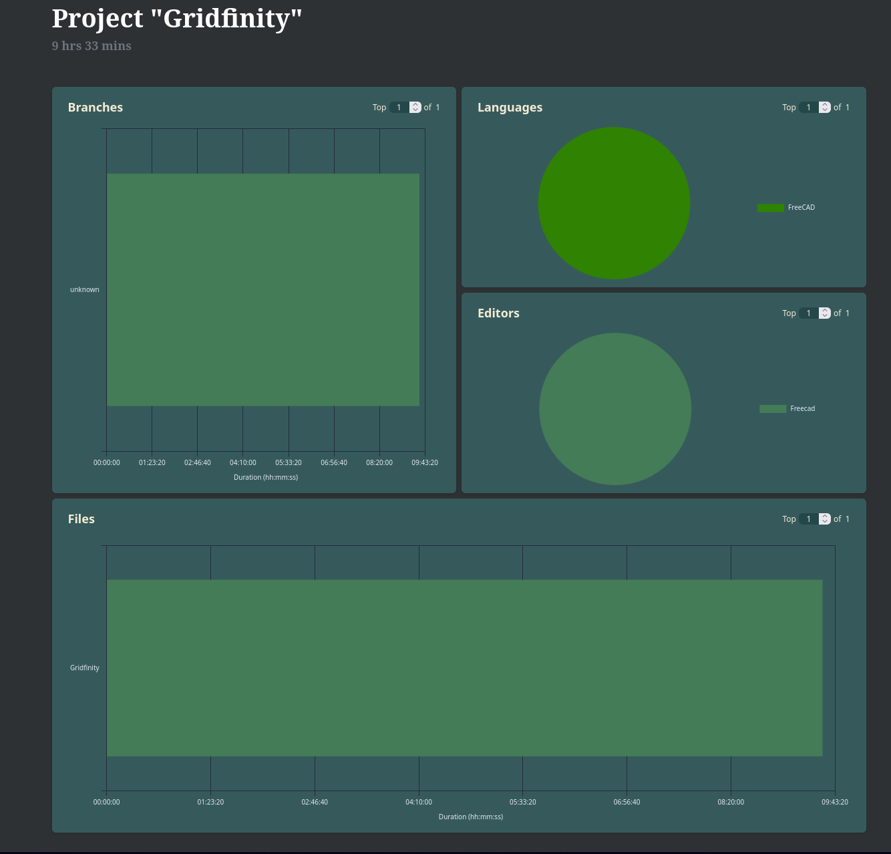

# Freecad-WakaTime
A simple FreeCAD WakaTime extension

## What is WakaTime?
[WakaTime](https://wakatime.com/) is an open-source time tracking tool. It provides insights into how much time one spends in different software projects, languages, and files.

## What is FreeCAD-WakaTime?
The `FreeCAD-WakaTime` addon integrates WakaTime with FreeCAD. This allows one to track the time spent working on FreeCAD projects. This extension logs one's activity and sends it to a corresponding WakaTime account, where detailed reports and analytics can be viewed.

## Installation

### Prerequisites
- WakaTime (wakatime.cfg) configured with your API key 


### Automatic Installation (recommended)

This workbench is conveniently available and therefore recommended to install via the FreeCAD [Addon Manager](https://wiki.freecad.org/Std_AddonMgr).  

* Within FreeCAD, go to `Tools > Addon Manager`
* Search for **FreeCad-wakatime** in the workbench category
* Install the FreeCAD-Wakatime workbench
* When prompted to restart FreeCAD, click 'Ok'

Result: upon re-opening FreeCAD, FreeCAD-Wakatime workbench will be availabe as a workbench.

### Manual Installation

<details><summary>Expand for directions to manually install this workbench</summary>

The install path for FreeCAD modules depends on the operating system used.

To find the user's application data directory, enter the following command in FreeCAD's Python console:

```python
App.getUserAppDataDir()
```

Examples for different operating systems:

- **Linux:** `/home/<user>/.local/share/FreeCAD/Mod/`
- **macOS:** `/Users/<user>/Library/Preferences/FreeCAD/Mod/`
- **Windows:** `C:\Users\<user>\AppData\Roaming\FreeCAD\Mod\`

Navigate to the `Mod` directory (create it if it doesn't exist) using the CLI and use Git to install FreeCad-wakatime:

```shell
git clone https://github.com/Pegoku/freecad-wakatime.git
```

#### Manual Update

Navigate to the `Mod/freecad-wakatime` directory using the CLI and use Git to update the extension:

```shell
git pull
```

</details>

## Usage
Once installed, the FreeCad-wakatime workbench will be available, and you'll be able to enable or disable the tracking of time you spend working on your FreeCAD projects. You can view your coding activity on the WakaTime dashboard.

Freecad:



Wakatime:



## Report Bugs

If you encounter any bugs or issues while using the FreeCad-wakatime extension, please report them by opening an issue on the [GitHub Issues](https://github.com/Pegoku/freecad-wakatime/issues) page.
Your feedback is valuable and helps improve the extension.

## License
This project is licensed under the LGPL-2.1 license. See the [LICENSE](https://github.com/Pegoku/freecad-wakatime/blob/main/LICENSE) file for more details.

